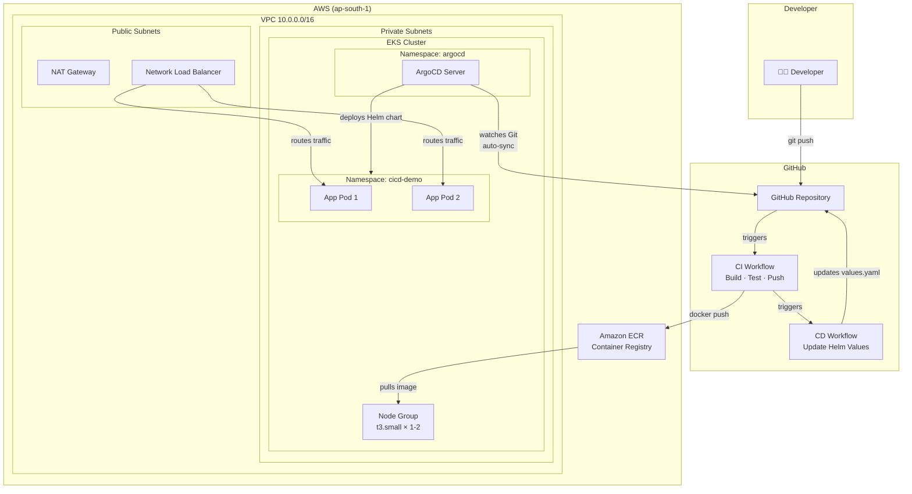
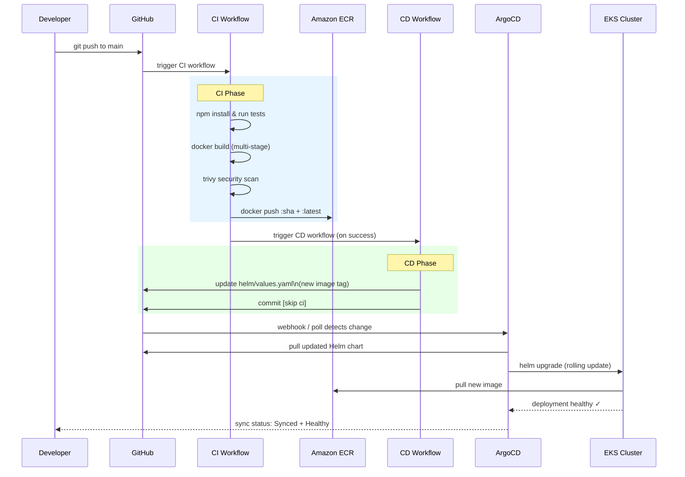
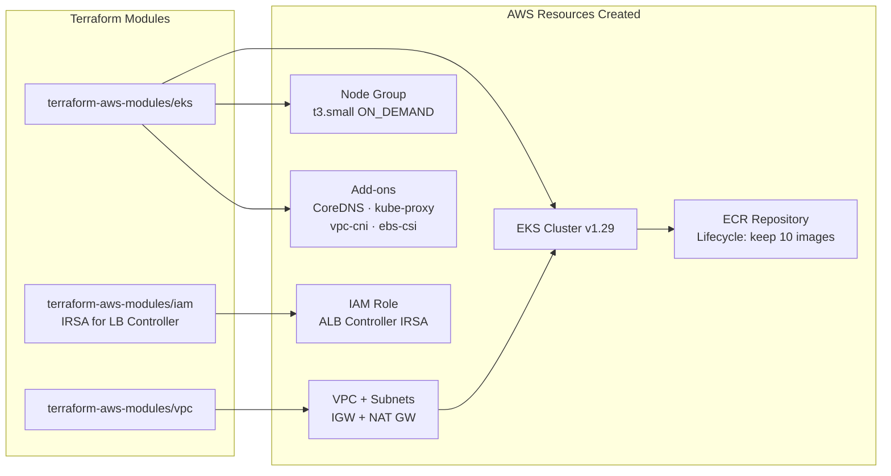
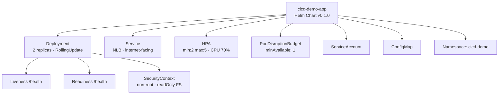

# terraform-aws-cicd

AWS Infrastructure as Code with Terraform, CI/CD pipelines, Kubernetes (EKS), Helm, and ArgoCD.

## Repository Structure

```
terraform-aws-cicd/
├── aws-ec2/          # EC2 instances with security groups
├── aws-s3/           # S3 buckets with versioning & policies
├── aws-vpc/          # Production-ready VPC architecture
└── cicd-k8s-project/ # Full CI/CD pipeline + EKS + ArgoCD
```

---

## Architecture Overview



---

## CI/CD Pipeline Flow



---

## EKS Infrastructure



---

## Helm Chart Structure



---

## Projects

### [aws-vpc](./aws-vpc/)
Production-ready VPC with public/private subnets, NAT Gateway, Internet Gateway, and security groups across multiple AZs.

### [aws-ec2](./aws-ec2/)
EC2 instance provisioning with key pairs, security groups, and user data scripts.

### [aws-s3](./aws-s3/)
S3 bucket setup with versioning, lifecycle policies, and bucket policies.

### [cicd-k8s-project](./cicd-k8s-project/)
Full end-to-end CI/CD pipeline:
- **App** — Node.js Express REST API with Jest tests
- **Docker** — Multi-stage Dockerfile with health checks
- **CI** — GitHub Actions: test → build → push to ECR → Trivy scan
- **CD** — GitHub Actions: update Helm values → ArgoCD auto-sync
- **Terraform** — EKS cluster + VPC + ECR + LB Controller IRSA
- **Helm** — Deployment, Service (NLB), HPA, PDB, ConfigMap
- **ArgoCD** — GitOps auto-sync with self-heal and prune

---

## Quick Start

### 1. Provision Infrastructure
```bash
cd cicd-k8s-project/terraform/eks
terraform init
terraform apply
```

### 2. Install ArgoCD
```bash
bash cicd-k8s-project/argocd/install-argocd.sh cicd-demo-cluster ap-south-1
```

### 3. Install AWS Load Balancer Controller
```bash
bash cicd-k8s-project/argocd/install-lb-controller.sh \
  cicd-demo-cluster ap-south-1 <lb_controller_role_arn>
```

### 4. Apply ArgoCD Application
```bash
# Update repoURL in argocd/argocd-app.yaml first
kubectl apply -f cicd-k8s-project/argocd/argocd-app.yaml
```

### 5. Trigger CI/CD
```bash
git push origin main   # → CI builds & pushes → CD deploys via ArgoCD
```

### 6. Test Traffic
```bash
bash cicd-k8s-project/scripts/test-traffic.sh
```

---

## GitHub Actions Secrets Required

| Secret | Description |
|---|---|
| `AWS_ACCESS_KEY_ID` | IAM user access key |
| `AWS_SECRET_ACCESS_KEY` | IAM user secret key |
| `ARGOCD_ADMIN_PASSWORD` | ArgoCD admin password (set after install) |

## Cost Estimate (ap-south-1)

| Resource | Cost/hr |
|---|---|
| EKS Control Plane | $0.10 |
| t3.small node × 1 | $0.027 |
| NAT Gateway | $0.045 |
| NLB | $0.008 |
| **Total** | **~$0.18/hr** |

> Destroy when not in use: `cd cicd-k8s-project/terraform/eks && terraform destroy`
