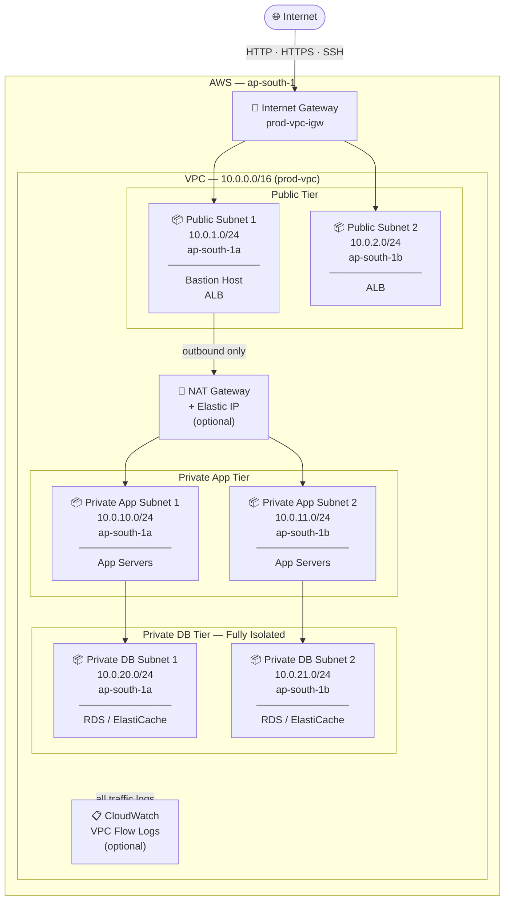
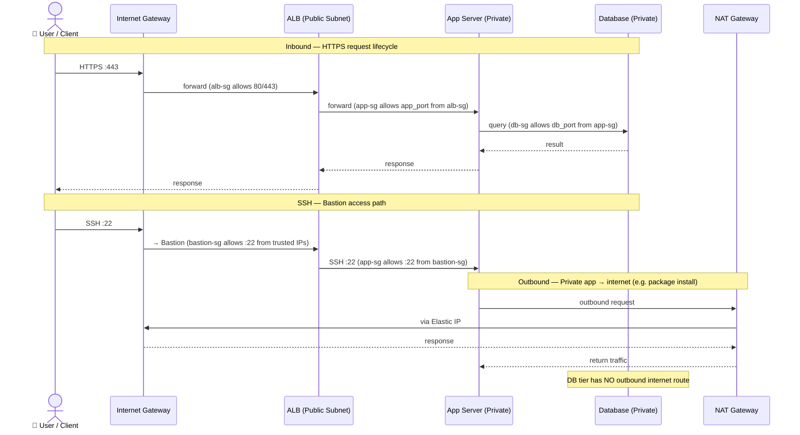
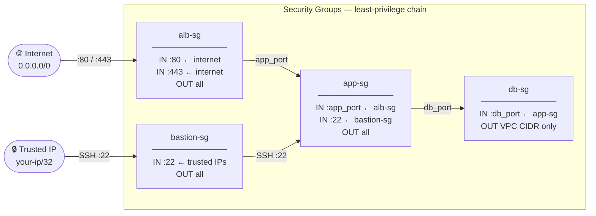
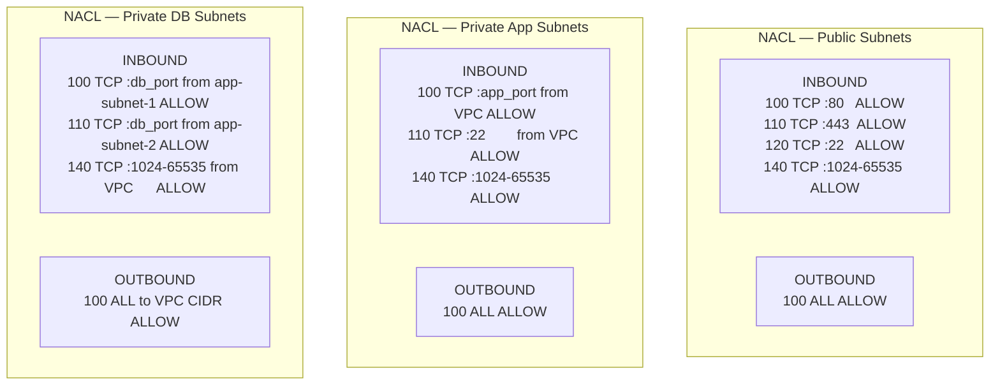

# AWS VPC Architecture — Terraform

A production-ready, multi-tier VPC on AWS built with Terraform.

---

## Architecture Diagram



---

## Resources Created

| Resource | Count | Purpose |
|---|---|---|
| VPC | 1 | Isolated network with DNS enabled |
| Internet Gateway | 1 | Public internet access |
| Public Subnets | 2 (multi-AZ) | ALB, Bastion host |
| Private App Subnets | 2 (multi-AZ) | Application servers |
| Private DB Subnets | 2 (multi-AZ) | Databases (RDS, ElastiCache) |
| Elastic IP | 1 | Static IP for NAT Gateway |
| NAT Gateway | 1 | Outbound internet for private subnets |
| Route Tables | 3 | Public, Private-App, Private-DB |
| Security Group: Bastion | 1 | SSH from trusted IPs only |
| Security Group: ALB | 1 | HTTP/HTTPS from internet |
| Security Group: App | 1 | App port from ALB + SSH from Bastion |
| Security Group: DB | 1 | DB port from app tier only |
| Network ACL: Public | 1 | Subnet-level traffic filtering |
| Network ACL: Private App | 1 | Subnet-level traffic filtering |
| Network ACL: Private DB | 1 | Subnet-level traffic filtering |
| VPC Flow Logs | 1 | All traffic captured to CloudWatch |
| IAM Role + Policy | 1 each | Flow logs write permission |

---

## Traffic Flow



---

## Security Model

### Security Groups (stateful)



### Network ACLs (stateless — second layer)



| NACL | Key Rules |
|---|---|
| Public | Allow 80/443/22 inbound; ephemeral ports; all outbound |
| Private App | Allow `app_port`/22 from VPC; ephemeral ports; all outbound |
| Private DB | Allow `db_port` from app subnets only; VPC-only outbound |

---

## Prerequisites

- [Terraform](https://developer.hashicorp.com/terraform/downloads) >= 1.3
- AWS credentials set as environment variables:
  ```bash
  export AWS_ACCESS_KEY_ID="your-access-key"
  export AWS_SECRET_ACCESS_KEY="your-secret-key"
  ```

---

## Usage

```bash
# 1. Navigate to the module
cd aws-vpc

# 2. Initialise providers
terraform init

# 3. Preview changes
terraform plan

# 4. Apply
terraform apply

# 5. Destroy when done
terraform destroy
```

---

## Key Variables

| Variable | Default | Description |
|---|---|---|
| `region` | `ap-south-1` | AWS region |
| `vpc_cidr` | `10.0.0.0/16` | VPC address space |
| `availability_zones` | `[ap-south-1a, ap-south-1b]` | AZs for subnets |
| `trusted_cidr_blocks` | `0.0.0.0/0` | **Restrict to your IP in production** |
| `app_port` | `8080` | Application listening port |
| `db_port` | `5432` | Database listening port |
| `flow_log_retention_days` | `30` | CloudWatch log retention |

---

## Outputs

After `terraform apply`, the following values are exported for use in other modules:

- `vpc_id` — attach EC2, RDS, ECS clusters
- `public_subnet_ids` — place ALB and bastion
- `private_app_subnet_ids` — place app servers / ECS tasks
- `private_db_subnet_ids` — place RDS subnet group
- `alb_sg_id`, `app_sg_id`, `db_sg_id` — reference from EC2/RDS modules
- `nat_gateway_public_ip` — whitelist in external services

---

## Cost Notes

- **NAT Gateway** — ~$32/month + data transfer charges. For dev/test, consider a NAT instance instead.
- **VPC Flow Logs** — CloudWatch ingestion + storage charges apply. Adjust `flow_log_retention_days` to control cost.
- All other VPC resources (subnets, route tables, IGW, NACLs, SGs) are **free**.
